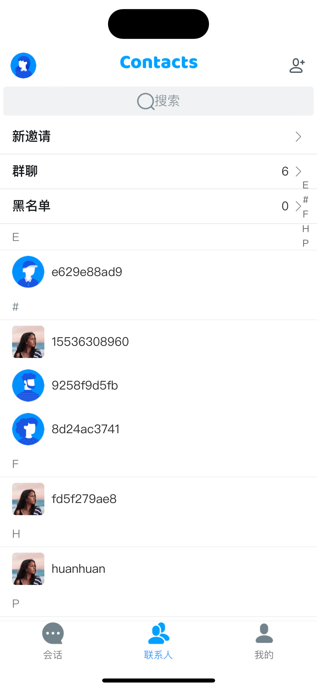

# webim-uniapp-demo-vue2

## 介绍

demo 包含以下功能

- 会话列表
- 系统通知
- 联系人
- 添加好友
- 群组创建
- 群组详情
- 群属性(不包含群头像功能)
- 我的
- 用户属性
- 用户在线状态
- 单人聊天
- 群组聊天
- 消息免打扰
- 文本、图片、语音、个人名片收发。

## 在本地跑起来

拉取代码，在 HBuliderX 工具点击运行至想要的平台中即可运行起来。

```bash
# install dependencies
npm install or yarn install
```

## 项目结构核心目录说明

```shell
|- components 自定义组件目录
    |-swipedelete 测滑删除组件
|-static/images demo中用到的图片
|-constant 相关常量
    |-emoji 表情
    |-index 导出相关常量
|-EaseIM 环信IM核心逻辑文件
    |-config IM相关配置，appkey、api_url、socket_url在这里修改
    |-constant 相关常量
    |-emApis 项目中所用IM SDK api方法
		|-emAboutAck 消息已读回执、会话已读回执、撤回回执
		|-emConnect 登录、退出登录相关(https://doc.easemob.com/document/web/overview.html#%E7%94%A8%E6%88%B7%E7%99%BB%E5%BD%95)
		|-emContacts 好友相关(https://doc.easemob.com/document/web/user_relationship.html)
		|-emConversation 会话列表相关(https://doc.easemob.com/document/web/conversation_overview.html)
		|-emGroups 群组相关(https://doc.easemob.com/document/web/group_overview.html)
		|-emMessages 消息相关(https://doc.easemob.com/document/web/push.html)
		|-emPresence 用户在线状态相关(https://doc.easemob.com/document/web/presence.html)
		|-emSilent 免打扰相关(https://doc.easemob.com/document/web/push.html)
		|-emUserInfos 用户属性相关(https://doc.easemob.com/document/web/userprofile.html)
    |-emListener IM监听回调
		|-emConnectListener 连接状态相关
		|-emContactsListener 好友相关
		|-emErrorListener error相关
		|-emGroupListener 群组相关
		|-emMessagesListener 消息相关
		|-emPresenceListener 用户在线状态相关
    |-utils 相关工具
    |-index.js 核心sdk初始化在此js文件中完成并导出
|-layout 布局（tab-bar）
|-recorderCore H5录音包
|-pages 功能页面
	|-addContacts 添加好友、申请入群页
    |-blockMembers 黑名单页
    |-contacts 联系人页
    |-contactsDetail 联系人详情页
		|-editContactsRemark 设置、修改好友备注页
    |-conversation 会话列表页
    |-groupCreate 创建新群页
    |-groupDetail 群组详情页
		|-editGroupAttributes 设置、修改群内昵称页
		|-editGroupName 修改群名称页
		|-editGroupDescription 修改群描述页
    |-groupList 群组列表页
    |-groupMembers 群成员列表页
    |-home home页
    |-login 登录页
    |-mine 我的页
		|-myProfile 个人信息页
		|-editMyProfile 修改个人昵称页
		|-generalSetting 通用设置页
		|-noDisturbingSetting 消息免打扰设置页
    |-newInvite 新邀请页
    |-notification 通知入口页（群组、单人通知）
    |-emChatContainer emChat聊天容器组件
|-utils 工具类和sdk的一些配置
|-store store 全局状态管理
	|-modules
		|-contacts 好友、用户属性、用户在线状态相关
		|-conversation 会话相关
		|-group 群组相关
		|-inform 好友、群组通知相关
		|-login 登录相关
		|-message 消息相关
		|-receiveInvite 邀请信息相关
|-uni_modules uni插件包
|-node_modules 这个相信不需要特别说明（IMSDK在此中）
|-app.vue 项目根组件（注册IM监听事件、处理连接跳转）
|-app.css 一些全局样式
```

## demo 部分页面效果展示

### 登录页面


### 会话页面


### 联系人页面



### 我的页面


### 消息页面


### 在线状态订阅


### 群组列表


### 群组详情


## 项目中所依赖的三方库目录：

- `uview-ui`2.x
  > 依赖部分 ui 组件快捷实现部分 ui 效果。
- `z-paging`
  > 使用其滚动模式实现聊天页面滚动。
- `grapheme-splitter`
  > 用于切分 UniCode 编码的 emoji 表情字符串。
- `lodash`
  > 使用其内部提供的方法，用以快捷实现 js 部分逻辑。

## 已测试平台

- App-Android
- App-iOS
- Web-H5
- 微信小程序
